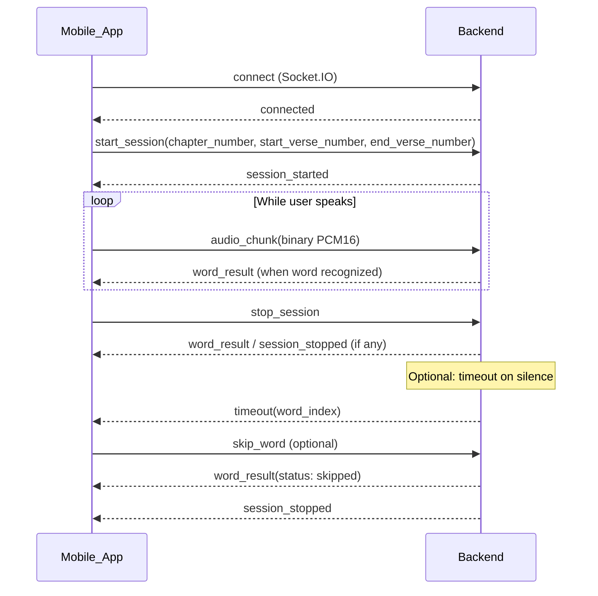

# Mobile Socket.IO Integration Guide

This document describes how to integrate a mobile app with the socket server: connecting via Socket.IO, streaming audio chunks, and handling word results and other server events.

## 1. Overview

- The server uses **Socket.IO** (not raw WebSocket).
- **Base URL:** Your server base (e.g. `https://your-api.com`) or `http://localhost:8000` for development. The Socket.IO path is `/socket.io`; use transport `websocket`.

## 2. Connection

- Use a Socket.IO client for your platform (e.g. Swift, Kotlin/Java).
- Connect to the base URL with `transports: ["websocket"]`. You can connect when the user is ready to start a session or when the relevant screen loads. There is no authentication in the current implementation.

## 3. Client → Server (emit) events

| Event | Payload | When |
|-------|---------|------|
| `start_session` | `{ chapter_number: Int, start_verse_number: Int, end_verse_number: Int }` | After connection; starts a session for the given range. |
| `audio_chunk` | **Binary:** PCM 16-bit mono, 16 kHz (see Audio format below) | Stream repeatedly while the user is speaking (e.g. every ~100–150 ms). |
| `stop_session` | (none or empty) | When the user stops the session; server flushes VAD and may emit one more `word_result` or `session_stopped`. |
| `skip_word` | (none or empty) | Skip the current word; server emits `word_result` with `status: "skipped"` and advances. |

## 4. Server → Client (on) events

| Event | Payload | Meaning |
|-------|---------|--------|
| `session_started` | `{}` | Session is ready; start streaming audio. |
| `word_result` | `{ chapter_number, verse_number, word_number, status }` | One word result. `status` is `"correct"`, `"incorrect"`, or `"skipped"`. |
| `session_stopped` | `{}` | All words are done (or stream ended past the last word). |
| `timeout` | `{ word_index: Int }` | Prolonged silence; prompt the user to try again for the current word. |
| `session_error` | `{ reason?: String }` | Error (e.g. invalid range). |

## 5. Audio format

- **Format:** PCM, 16-bit signed integer, little-endian, **mono**, **16 kHz**.
- **Chunk:** Send raw bytes (e.g. `Data` / `ByteArray` or your platform’s equivalent). **No WAV header.** The server expects raw PCM16 bytes.
- **Chunk size:** Send every ~100–200 ms (e.g. 2400 samples = 4800 bytes for ~150 ms). Use the Socket.IO client’s binary emit for the `audio_chunk` event.
- **Capture:** Configure your audio pipeline for 16 kHz, 1 channel, and convert to Int16 if the API provides Float32.

## 6. Recommended flow (sequence)

1. Connect to the socket server when the user is ready to start a session.
2. Emit `start_session` with `{ chapter_number, start_verse_number, end_verse_number }`.
3. On `session_started`, start capturing the microphone and streaming chunks via `audio_chunk`.
4. On each `word_result`, update the UI (highlight word, show score/status).
5. On `timeout`, prompt the user to try again for the current word.
6. On `session_stopped`, stop sending chunks and show the summary.
7. When the user stops: emit `stop_session`. To run another session, emit `start_session` again (you can stay connected).

## 7. Sequence diagram

