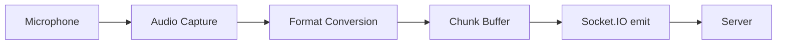

# Audio Format & Streaming

This guide covers the required audio format and how to capture and stream audio to the server on different platforms.

## Format Requirements

The server expects audio in a specific format.

### Audio Specifications

| Property | Required Value |
|----------|----------------|
| **Format** | PCM (Pulse Code Modulation) |
| **Bit depth** | 16-bit signed integer |
| **Byte order** | Little-endian |
| **Channels** | Mono (1 channel) |
| **Sample rate** | 16,000 Hz (16 kHz) |

### Why These Specifications?

- **16 kHz**: Standard for speech recognition; balances quality and bandwidth
- **16-bit PCM**: Provides sufficient dynamic range for voice without compression artifacts
- **Mono**: Voice recognition doesn't benefit from stereo; mono reduces bandwidth by 50%
- **Little-endian**: Standard byte order for most platforms

### Chunk Format

Audio is streamed in chunks via the `audio_chunk` event.

- **Raw PCM bytes** - No headers, no containers
- **No WAV header** - Do not wrap in WAV/RIFF format
- **No compression** - No MP3, AAC, Opus, etc.

### Chunk Size

| Chunk Duration | Samples | Bytes |
|----------------|---------|-------|
| 100 ms | 1,600 | 3,200 |
| 150 ms | 2,400 | 4,800 |
| 200 ms | 3,200 | 6,400 |

**Recommended:** 100-200ms chunks for a good balance of latency and efficiency.

## Streaming Flow



1. **Capture** - Get audio from the microphone
2. **Convert** - Ensure 16-bit PCM, 16 kHz, mono
3. **Buffer** - Accumulate ~100-200ms of samples
4. **Stream** - Emit chunks via `audio_chunk` event

## Audio Capture Implementation

::: code-group

```javascript [JavaScript]
const SAMPLE_RATE = 16000;
const CHUNK_DURATION_MS = 150;

let audioContext;
let mediaStream;
let processor;

async function startRecording(socket) {
    // Request microphone access
    mediaStream = await navigator.mediaDevices.getUserMedia({
        audio: {
            sampleRate: SAMPLE_RATE,
            channelCount: 1,
            echoCancellation: true,
            noiseSuppression: true
        }
    });

    // Create audio context at 16kHz
    audioContext = new AudioContext({ sampleRate: SAMPLE_RATE });
    
    const source = audioContext.createMediaStreamSource(mediaStream);
    
    // Calculate buffer size (power of 2)
    const samplesPerChunk = Math.ceil(SAMPLE_RATE * CHUNK_DURATION_MS / 1000);
    const bufferSize = Math.pow(2, Math.ceil(Math.log2(samplesPerChunk)));
    
    processor = audioContext.createScriptProcessor(bufferSize, 1, 1);
    
    processor.onaudioprocess = (event) => {
        const float32Data = event.inputBuffer.getChannelData(0);
        const int16Data = float32ToInt16(float32Data);
        socket.emit("audio_chunk", int16Data.buffer);
    };
    
    source.connect(processor);
    processor.connect(audioContext.destination);
}

function stopRecording() {
    if (processor) {
        processor.disconnect();
        processor = null;
    }
    if (audioContext) {
        audioContext.close();
        audioContext = null;
    }
    if (mediaStream) {
        mediaStream.getTracks().forEach(track => track.stop());
        mediaStream = null;
    }
}

function float32ToInt16(float32Array) {
    const int16Array = new Int16Array(float32Array.length);
    for (let i = 0; i < float32Array.length; i++) {
        const s = float32Array[i];
        int16Array[i] = s < 0 ? s * 0x8000 : s * 0x7FFF;
    }
    return int16Array;
}
```

```swift [Swift]
import AVFoundation
import SocketIO

class AudioRecorder {
    private let audioEngine = AVAudioEngine()
    private let socket: SocketIOClient
    private let sampleRate: Double = 16000
    private let chunkDurationMs: Double = 150
    
    init(socket: SocketIOClient) {
        self.socket = socket
    }
    
    func startRecording() throws {
        let session = AVAudioSession.sharedInstance()
        try session.setCategory(.playAndRecord, mode: .measurement)
        try session.setPreferredSampleRate(sampleRate)
        try session.setActive(true)
        
        let inputNode = audioEngine.inputNode
        
        // Target format: 16-bit PCM, 16kHz, mono
        guard let format = AVAudioFormat(
            commonFormat: .pcmFormatInt16,
            sampleRate: sampleRate,
            channels: 1,
            interleaved: true
        ) else {
            throw NSError(domain: "AudioRecorder", code: 1, userInfo: nil)
        }
        
        let bufferSize = AVAudioFrameCount(sampleRate * chunkDurationMs / 1000)
        
        inputNode.installTap(
            onBus: 0,
            bufferSize: bufferSize,
            format: format
        ) { [weak self] buffer, time in
            self?.processBuffer(buffer)
        }
        
        try audioEngine.start()
    }
    
    func stopRecording() {
        audioEngine.inputNode.removeTap(onBus: 0)
        audioEngine.stop()
    }
    
    private func processBuffer(_ buffer: AVAudioPCMBuffer) {
        guard let int16Data = buffer.int16ChannelData else { return }
        
        let frameLength = Int(buffer.frameLength)
        let data = Data(bytes: int16Data[0], count: frameLength * 2)
        
        socket.emit("audio_chunk", data)
    }
}
```

```kotlin [Kotlin]
import android.Manifest
import android.media.AudioFormat
import android.media.AudioRecord
import android.media.MediaRecorder
import io.socket.client.Socket
import kotlinx.coroutines.*

class AudioRecorder(private val socket: Socket) {
    
    private val sampleRate = 16000
    private val chunkDurationMs = 150
    private var audioRecord: AudioRecord? = null
    private var recordingJob: Job? = null
    
    private val bufferSize: Int
        get() {
            val minSize = AudioRecord.getMinBufferSize(
                sampleRate,
                AudioFormat.CHANNEL_IN_MONO,
                AudioFormat.ENCODING_PCM_16BIT
            )
            val chunkSize = (sampleRate * chunkDurationMs / 1000) * 2 // bytes
            return maxOf(minSize, chunkSize)
        }
    
    fun startRecording() {
        audioRecord = AudioRecord(
            MediaRecorder.AudioSource.MIC,
            sampleRate,
            AudioFormat.CHANNEL_IN_MONO,
            AudioFormat.ENCODING_PCM_16BIT,
            bufferSize
        )
        
        audioRecord?.startRecording()
        
        recordingJob = CoroutineScope(Dispatchers.IO).launch {
            val chunkBytes = (sampleRate * chunkDurationMs / 1000) * 2
            val buffer = ByteArray(chunkBytes)
            
            while (isActive) {
                val bytesRead = audioRecord?.read(buffer, 0, buffer.size) ?: 0
                if (bytesRead > 0) {
                    socket.emit("audio_chunk", buffer.copyOf(bytesRead))
                }
            }
        }
    }
    
    fun stopRecording() {
        recordingJob?.cancel()
        recordingJob = null
        
        audioRecord?.stop()
        audioRecord?.release()
        audioRecord = null
    }
}
```

```dart [Dart]
import 'dart:async';
import 'dart:typed_data';
import 'package:record/record.dart';
import 'package:socket_io_client/socket_io_client.dart' as IO;

class AudioStreamRecorder {
  final IO.Socket socket;
  final _recorder = AudioRecorder();
  StreamSubscription<Uint8List>? _subscription;
  
  static const int sampleRate = 16000;
  static const int chunkDurationMs = 150;
  
  AudioStreamRecorder(this.socket);
  
  Future<void> startRecording() async {
    if (!await _recorder.hasPermission()) {
      throw Exception('Microphone permission denied');
    }
    
    final stream = await _recorder.startStream(RecordConfig(
      encoder: AudioEncoder.pcm16bits,
      sampleRate: sampleRate,
      numChannels: 1,
    ));
    
    _subscription = stream.listen((data) {
      socket.emit('audio_chunk', data);
    });
  }
  
  Future<void> stopRecording() async {
    await _subscription?.cancel();
    _subscription = null;
    await _recorder.stop();
  }
}
```

:::


## Permissions

### iOS

Add to `Info.plist`:

```xml
<key>NSMicrophoneUsageDescription</key>
<string>This app needs microphone access to recognize your Quran recitation.</string>
```

### Android

Add to `AndroidManifest.xml`:

```xml
<uses-permission android:name="android.permission.RECORD_AUDIO" />
```

Request at runtime:

::: code-group

```kotlin [Kotlin]
val requestPermissionLauncher = registerForActivityResult(
    ActivityResultContracts.RequestPermission()
) { isGranted ->
    if (isGranted) {
        startRecording()
    }
}

requestPermissionLauncher.launch(Manifest.permission.RECORD_AUDIO)
```

```dart [Dart]
// Using permission_handler package
final status = await Permission.microphone.request();
if (status.isGranted) {
  startRecording();
}
```

:::
