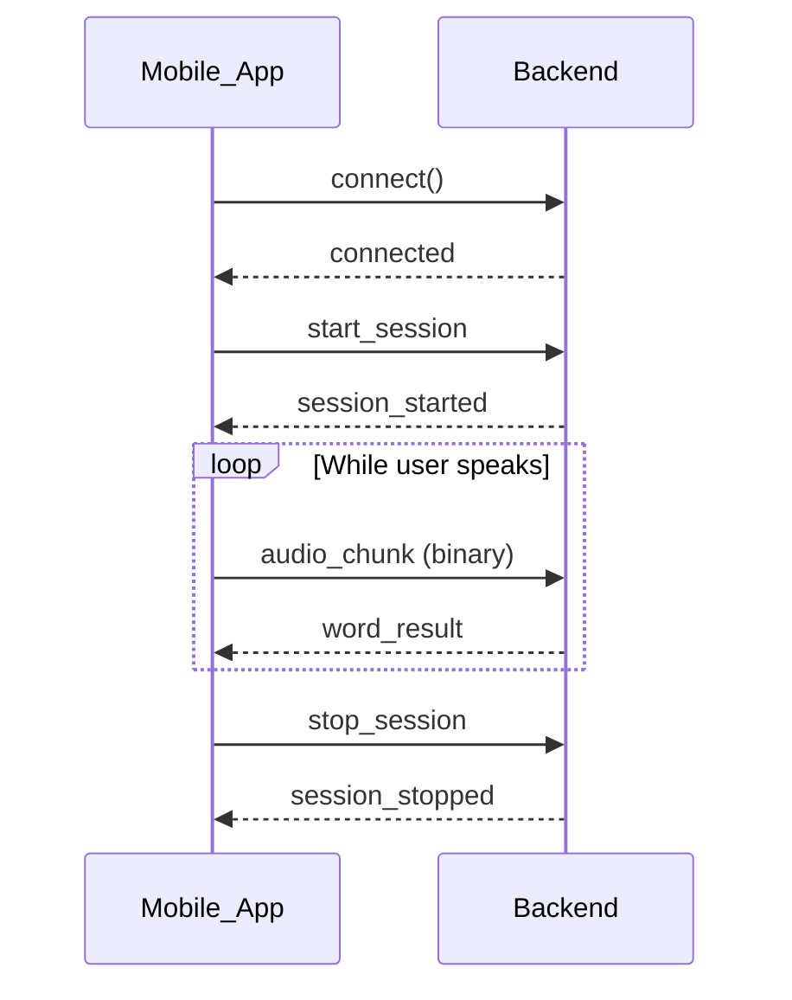

# Socket Events Overview {#events-overview}

The Quran API uses a simple event-based protocol. This section documents all events you need to implement for a complete integration.

## Event Types {#event-types}

### Client to Server (Emit) {#client-to-server-emit}

Events your app sends to the server:

| Event | Purpose | Payload |
|-------|---------|---------|
| [`start_session`](/events/client-events#start-session) | Begin a new recognition session | Start/end chapter and verse range (+ optional `score_threshold`, `mode`) |
| [`audio_chunk`](/events/client-events#audio-chunk) | Stream audio data | Binary PCM data |
| [`stop_session`](/events/client-events#stop-session) | End the current session | None |
| [`skip_word`](/events/client-events#skip-word) | Skip the current word | None |

### Server to Client (Listen) {#server-to-client-listen}

Events your app receives from the server:

| Event | Purpose | Payload |
|-------|---------|---------|
| [`session_started`](/events/server-events#session-started) | Session is ready | id |
| [`verse_detected`](/events/server-events#verse-detected) | Start verse identified | chapter_number, verse_number, word_number |
| [`verse_detection_failed`](/events/server-events#verse-detection-failed) | Start verse not recognized | Empty object |
| [`word_result`](/events/server-events#word-result) | Recognition result for a word | Word details and status |
| [`session_stopped`](/events/server-events#session-stopped) | Session has ended | Empty object |
| [`session_error`](/events/server-events#session-error) | An error occurred | Error reason |

## Typical Flow



## Event Handling Pattern

::: code-group

```javascript [JavaScript]
// Listen for events
socket.on("session_started", () => { /* start streaming */ });
socket.on("word_result", (data) => { /* update UI */ });
socket.on("session_stopped", () => { /* cleanup */ });
socket.on("session_error", (data) => { /* show error */ });

// Emit events
socket.emit("start_session", {
  start_chapter_number: 1,
  start_verse_number: 1,
  end_chapter_number: 1,
  end_verse_number: 7,
  score_threshold: 0.6,  // optional (0-1); omit to use server default
  mode: "continuous"     // optional; "word_by_word" (default) or "continuous"
});
socket.emit("audio_chunk", audioBuffer);
socket.emit("stop_session");
socket.emit("skip_word");
```

```swift [Swift]
// Listen for events
socket.on("session_started") { data, ack in /* start streaming */ }
socket.on("word_result") { data, ack in /* update UI */ }
socket.on("session_stopped") { data, ack in /* cleanup */ }
socket.on("session_error") { data, ack in /* show error */ }

// Emit events
socket.emit("start_session", [
    "start_chapter_number": 1,
    "start_verse_number": 1,
    "end_chapter_number": 1,
    "end_verse_number": 7,
    "score_threshold": 0.6,  // optional (0-1)
    "mode": "continuous"     // optional; "word_by_word" (default) or "continuous"
])
socket.emit("audio_chunk", audioData)
socket.emit("stop_session")
socket.emit("skip_word")
```

```kotlin [Kotlin]
// Listen for events
socket.on("session_started") { /* start streaming */ }
socket.on("word_result") { args -> /* update UI */ }
socket.on("session_stopped") { /* cleanup */ }
socket.on("session_error") { args -> /* show error */ }

// Emit events
socket.emit("start_session", JSONObject().apply {
    put("start_chapter_number", 1)
    put("start_verse_number", 1)
    put("end_chapter_number", 1)
    put("end_verse_number", 7)
    put("score_threshold", 0.6)  // optional (0-1)
    put("mode", "continuous")    // optional; "word_by_word" (default) or "continuous"
})
socket.emit("audio_chunk", audioByteArray)
socket.emit("stop_session")
socket.emit("skip_word")
```

:::

## Next Steps

- [Client Events](/events/client-events#client-events) - Detailed documentation for events you send
- [Server Events](/events/server-events#server-events) - Detailed documentation for events you receive
