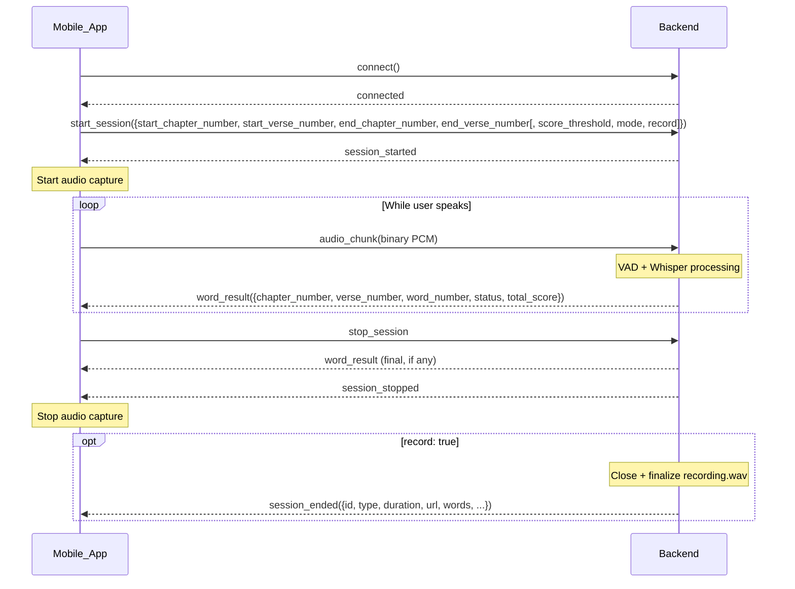
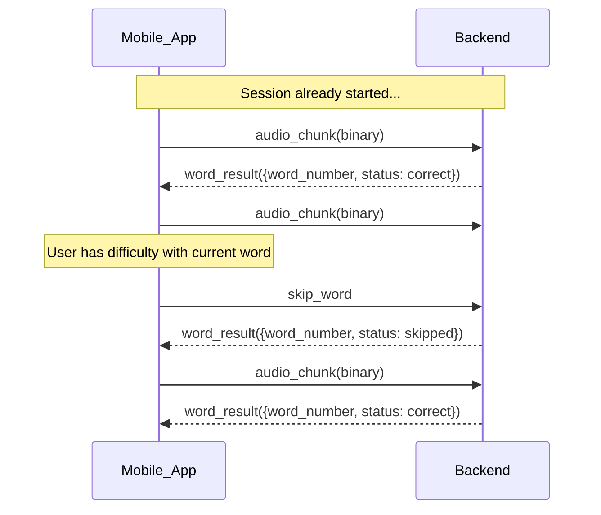
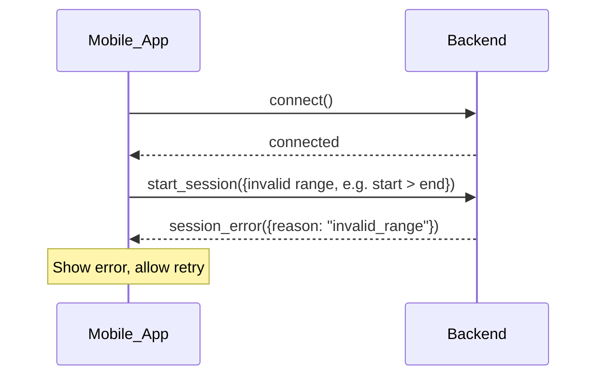
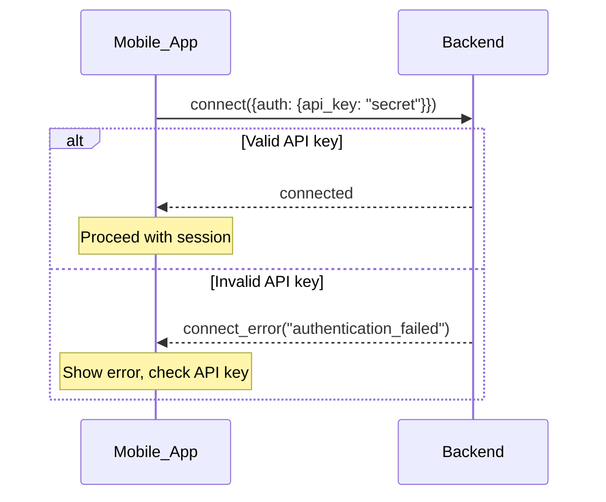
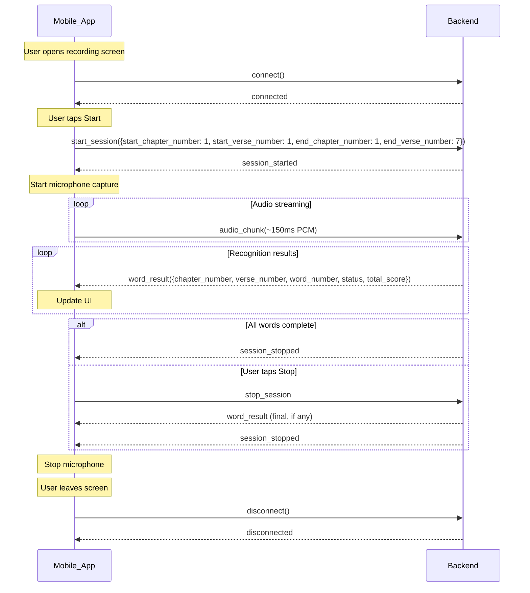
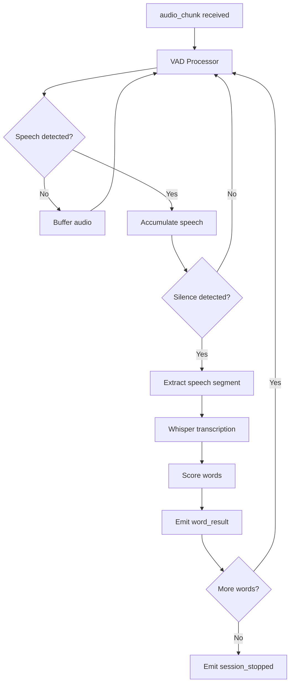
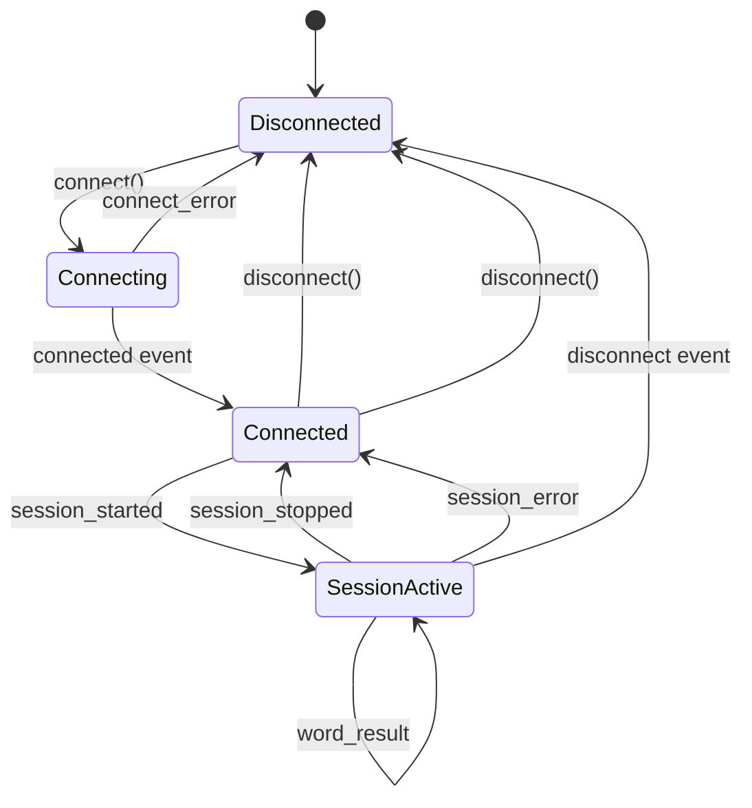
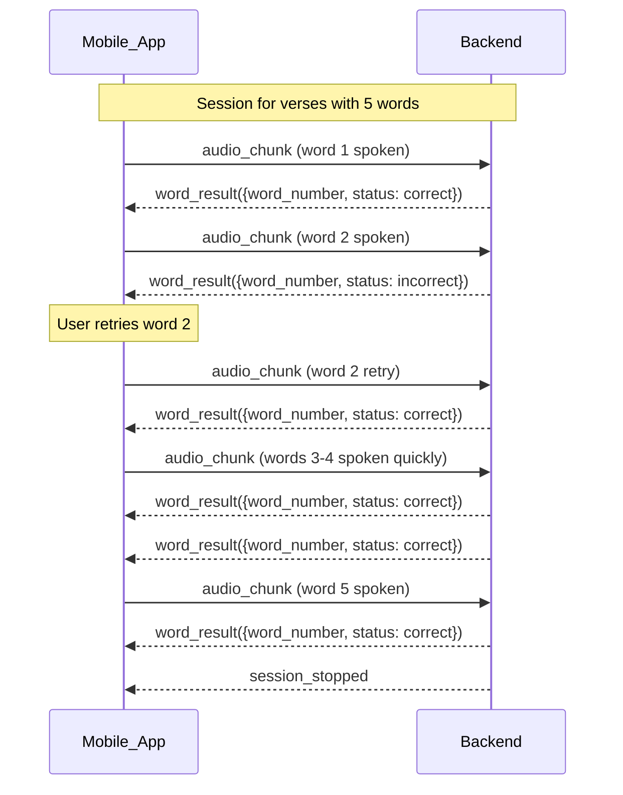
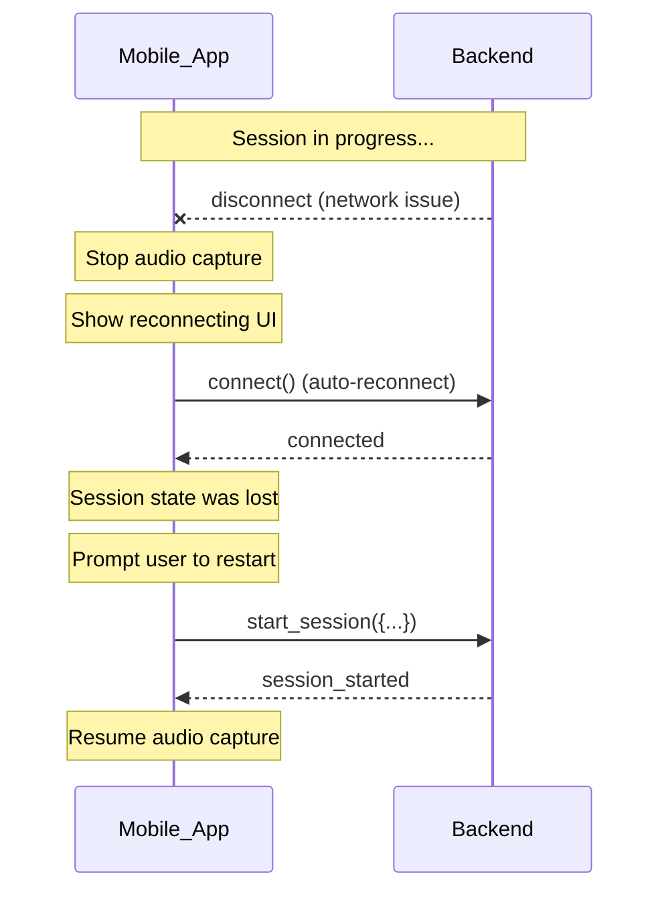

# Sequence Diagrams

Visual representations of the Socket.IO communication flow.

## Basic Session Flow

The standard flow for a complete recognition session:

## Session with Skip

Flow when the user skips a word:

## Session with Error

Flow when an error occurs:

## Authentication Flow

Authentication is required (enabled by default). Connection with API key:

## Complete Session Lifecycle

Full lifecycle including connection management:

## Audio Processing Pipeline

Internal server flow (for reference):

## State Diagram

Client-side state machine:

## Multi-Word Recognition

How multiple words are processed in sequence:

## Reconnection Handling

Handling disconnections gracefully:

